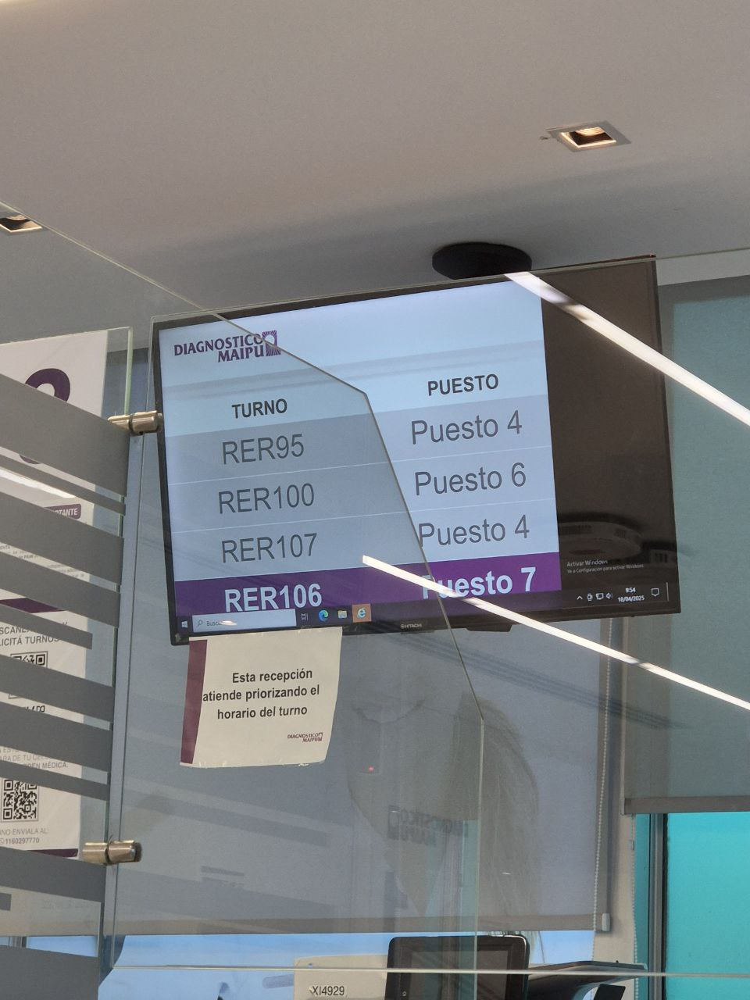

# La ilusión del turno: cuando la comunicación no coordina

---
layout: post
title: "La ilusión del turno: cuando la comunicación no coordina"
date: 2025-08-06
---

 
 

Fui a hacerme un estudio.  
Saqué número. Me dieron el RER105.  
En la pantalla llamaban al RER95, luego al RER100, RER106 y RER107.

Me quedé mirando con cara de *"¿me saltearon?"*

Y no era solo yo. Todos estaban igual: preguntando al mostrador qué pasaba con su número.

---

## ¿Qué estaba pasando?

Una nota en la ventanilla lo aclaraba:

> “Esta recepción atiende priorizando el **horario del turno**.”

Y ahí entendí todo.

---

## ¿Cuál fue el problema?

No fue de lógica. **Fue de comunicación.**  
El sistema prioriza turnos con horario agendado (lógico).  
Pero visualmente muestra una secuencia de números (RER95, RER96, RER97...) que **invita a pensar que es por orden de llegada**.

El resultado:

- Usuarios confundidos.
- Personal administrativo saturado.
- Frustración innecesaria.
- La sensación de “me pasaron por arriba”.

---

## ¿Qué se puede hacer mejor?

Muy simple: **alinear la expectativa visual con la lógica real.**

- Mostrar en la pantalla no solo el número que está siendo atendido, sino también el **turno asignado** de cada persona.
- O incluir un texto claro en la pantalla tipo:  
  *“Los turnos se atienden según su horario, no por orden de llegada”*.
- O aún mejor: **mostrar tu número en pantalla con un contador de “faltan X antes que vos”**.

---

## ¿Por qué esto importa en liderazgo?

Porque pasa lo mismo en los equipos:

- Se define una lógica (priorizamos tal cosa).
- Pero se comunica otra (o no se comunica nada).
- El equipo se frustra, no entiende, se descoordina.

---

## Moraleja

> La lógica no sirve si la interfaz no la explica.

No lideres como una pantalla que muestra números sin contexto.  
Liderá como quien da señales claras, consistentes y previsibles.

Eso también es liderazgo en modo debug.
